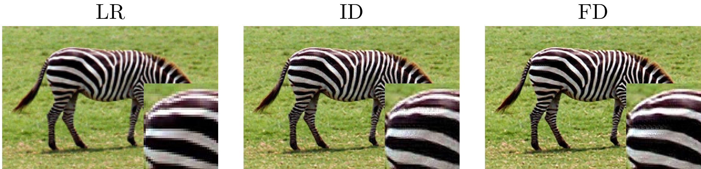

# Fractional Derivative in Sparse Super Resolution
 
 
Here you can find MATLAB code for reproducing the results of the following paper:
"Fractional Derivative in Sparse Super Resolution"
 
In addition to MATLAB codes, a few Python script is also provided for creating tables of the paper.
  

## Dataset 

<b> Download Training and Test Images: </b>   
 The <b>Train</b> dataset is from the Yang's site: 
 <a href="http://www.ifp.illinois.edu/~jyang29/"> http://www.ifp.illinois.edu/~jyang29/ </a> which is provided here, if you download or clone this repository (in folder Data/Training).
 
 Test datasets in the paper are pupolar datasets in the field of Super-Resolution.
 The following datasets are used in the paper: 
  <ul>
  <li>BSD100 </li>
  <li>MANGA109  </li>
  <li>Set5  </li>
  <li>Set14  </li>
  <li>URBAN100  </li>
</ul> 
which can be downloaded from <a href="https://cvnote.ddlee.cc/2019/09/22/image-super-resolution-datasets" > this site </a>. Note that the Ground truth images should be used as the input of the program. Producing low resolution images and then magnifying will be done automatically by the program.
As an example, dataset *Set5* is included in folder *data/Test/Set5* of this repository.

## The program

The core of the program is <a href="http://www.ifp.illinois.edu/~jyang29/"> Yang's </a> MATLAB code for his pioneering paper: 
J. Yang, J. Wright, T.S. Huang, and Y.Ma, "Image super-resolution via sparse
  representation", IEEE transactions on image processing, vol.19,
  no.11, pp.2861-2873, 2010

The main MATLAB file for running the program is: *SparseSR_Zooming.m*

*SparseSR_Zooming.m* is used for both Train and Test.

### Test

The simple approach is using the pre-trained dictionaries, which are in folder *Data/Dictionary*. Training the dictionary is a time-consuming task, hence we provided our trained dictionaries over various parameters, mentioned in the paper. BTW every one could be use *SparseSR_Zooming.m* and the Training images for creating his dictionary with his desired parameter settings, or arbitrary training images.

All of the test images are about 300 MB, but you can test only one dataset, by editing the following line in SparseSR_Zooming.m: 
*dataSets = {'BSDS100','Manga109','Set5','Set14','Urban100'}*
 
After setting the paths and parameters, you can run the program. 

#### Caution

Running the program with default parameters and for three zooming factors 3,4,5 and on all of the datasets, will produce huge number if images, which require <b>2.7 Giga byte</b> of storage space. 
For every test image, 7 images will be produced, in each zooming factor. The default value of zooming factor is 5, which requires about 700 MB of storage space.

Optionally you can un-comment *createLatexImageTables*, *createPlotsData* and *createTableData* for producing some tables demonstrated in the paper. 
Also *createSummaryTableDataSets.m* and *createSummaryTableDataSets_zooming.m* can be used for some other results, but these files are need some manual setting for reading the produced results.

### Training

For training the program using arbitrary images, after setting the related Paths, you should set *skip_smp_training* and *skip_dictionary_training* to false. The default values of these variables are true,  which is used for testing the program with pre-trained dictionaries.
When *skip_smp_training=false*, 50000 small patches from train images are selected and corresponding low and highresolution of the patches saved in *Xh, Xl*. After that, if *skip_dictionary_training=false*, these variables will be used to *coupled_dic_train()* for creating the appropriate dictionary. 
 
The resulting dictionary will be saved as *Data/Dictionary/Dictionary.mat*. 
Some previous trained dictionaries were renamed manually for testing purposes.

#### Image Tables

The aforementioned MATLAB files produce 8LaTeX tables and recinstructed images of various methods. But for producing images such as Figure 7 in the paper (the top Zebra image), which a portion of images is enlarged, a python script is prepared: *makeImagetable.ipynb*. This jupyter notebook can be run after running the MATLAB codes on test images.
