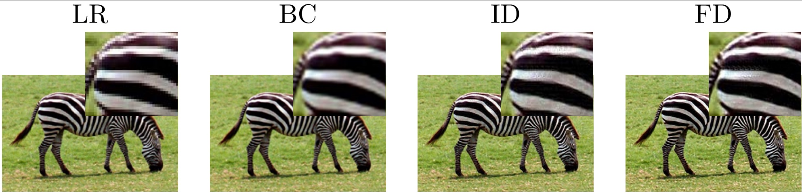

# Fractional Derivative in Sparse Super Resolution
 
 
Here you can find MATLAB code for reproducing the results of the following paper:
"Fractional Derivative in Sparse Super Resolution"
In addition to MATLAB codes, a few Python script is also provided for creating tables of the paper.
  

<b> Download Training and Test Images: </b>   
 The <b>Train</b> dataset is from the Yang's site: 
 <a href="http://www.ifp.illinois.edu/~jyang29/"> http://www.ifp.illinois.edu/~jyang29/ </a> which is provided here, if you download or clone this repository.
 
 You can download the dataset sets via the following links:   
  <ul>
  <li><a href="" >BSD100</a>  </li>
  <li><a href="" >MANGA109</a>  </li>
  <li><a href="" >Set5</a>  </li>
  <li><a href="" >Set14</a>  </li>
  <li><a href="" >URBAN100</a>  </li>
</ul> 

The main MATLAB file for running the program is: SparseSR_Zooming.m